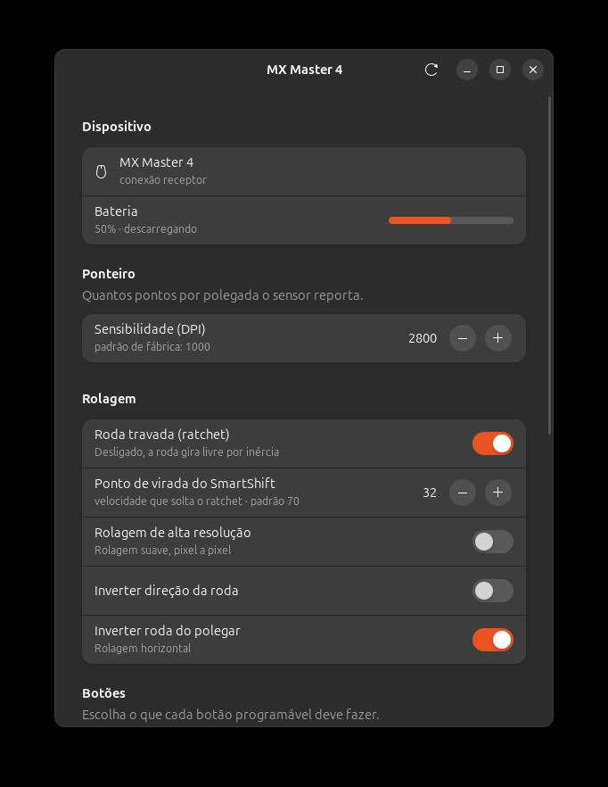

<h1 align="center">logi-tune-linux</h1>

<p align="center">
  <strong>Your MX Master 4, fully configurable on Linux.</strong><br>
  An open alternative to Logi Options+ — including the haptic motor and the
  Actions Ring button that no other Linux tool reaches.
</p>

<p align="center">
  <a href="https://github.com/renangraciano/logi-tune-linux/actions/workflows/tests.yml"></a>
  <a href="https://github.com/renangraciano/logi-tune-linux/releases/latest"></a>
  <a href="https://github.com/renangraciano/logi-tune-linux/releases"></a>
  <a href="https://github.com/renangraciano/logi-tune-linux/discussions"></a>
  <a href="https://github.com/renangraciano/logi-tune-linux/issues"></a>
</p>

<p align="center">
  <a href="SECURITY.md"></a>
  <a href="LICENSE"></a>
  
  
  <a href="CONTRIBUTING.md"></a>
  
</p>

<p align="center">
  <a href="README.pt-BR.md">🇧🇷 Leia em português</a>
</p>

<p align="center">
  
</p>

---

Logitech ships Options+ for Windows and macOS. On Linux you get nothing — no
DPI control, no SmartShift, no button remapping, and none of the MX Master 4's
new hardware.

This project talks **HID++ 2.0 straight to `/dev/hidraw`**. No Solaar, no
logiops, no root.

## What works

Every item below was verified against real hardware: an MX Master 4
(WPID `B042`, firmware `RBM 27.03.B0019`) on a Bolt receiver, Ubuntu 24.04.4,
GNOME 46, X11.

| | Capability | HID++ |
| --- | --- | --- |
| ✅ | Battery level and charging state | `0x1004` |
| ✅ | Pointer sensitivity (200–8000 DPI) | `0x2201` |
| ✅ | SmartShift threshold and wheel mode | `0x2111` |
| ✅ | High-resolution scrolling, wheel inversion | `0x2121` |
| ✅ | Thumb wheel direction | `0x2150` |
| ✅ | Button remapping and diversion | `0x1B04` |
| ✅ | Easy-Switch between three hosts | `0x1814` `0x1815` |
| ✅ | **Haptic feedback — 15 waveforms** | `0x19B0` |
| ✅ | Per-application profiles (X11) | — |
| ✅ | **53 actions to bind buttons to** | — |
| ✅ | Gestures on a held button (opt-in) | `0x1B04` |
| 🚧 | Actions Ring radial menu | `0x01A0` |

## Two things you will not find elsewhere

**The haptic motor works.** Feature `0x19B0` was undocumented. Probing the
hardware established that function `0x04` plays a waveform, that indices 0–14
are accepted, and that 15 and above are rejected with `INVALID_ARGUMENT`. Your
mouse can now buzz on command:

```bash
logitune haptic --all
```

**The Actions Ring button is reachable.** The MX Master 4 added a button that
exists on no earlier model — control `0x01A0`, task `0x0109`. It is both
remappable and divertable, so you can bind it to anything today:

```bash
logitune watch 0x01A0     # see the event arrive as you press it
```

Between the button and the motor, both hardware halves of the Actions Ring are
solved. What is left is drawing the radial menu — see the [roadmap](#roadmap).

## Install

```bash
# Dependencies (python3-xlib is only for per-application profiles)
sudo apt install python3-gi gir1.2-gtk-4.0 gir1.2-adw-1 python3-xlib pipx

# Device access without root (mouse + /dev/uinput for key synthesis)
sudo scripts/install-udev.sh

# Install. --system-site-packages lets the isolated environment reach the
# PyGObject that the GTK interface needs, which apt installed system-wide.
pipx install --system-site-packages .

# Add it to the application menu. pipx installs the commands but not a
# desktop entry, so without this the GUI never shows up in your launcher.
scripts/install-desktop.sh
```

Unplug and replug the receiver after installing the udev rule.

> **Why pipx?** Ubuntu 24.04 and other recent distributions mark the system
> Python as externally managed ([PEP 668](https://peps.python.org/pep-0668/)),
> so `pip install --user` refuses to run. pipx gives each application its own
> environment and puts `logitune`, `logitune-gui` and `logitune-daemon` on your
> `PATH`. If `~/.local/bin` is not in `PATH`, run `pipx ensurepath` and open a
> new shell.

## Use

There are three ways in, and they share the same settings.

**The app.** Search for *Logi Tune Linux* in your application menu, or run
`logitune-gui`. Sliders and switches apply to the mouse as you move them.

**The daemon**, running in the background, reconfiguring the mouse per
application. See [below](#per-application-profiles).

**The command line**, for scripting and for the reverse-engineering commands:

```bash
logitune                      # summary
logitune dpi 1600             # pointer sensitivity
logitune smartshift 40        # ratchet threshold
logitune scroll --invert
logitune buttons              # list controls and their mappings
logitune button back --remap 0x0052
logitune hosts                # paired computers
logitune host 2               # move the mouse to channel 2
logitune haptic 3             # play one vibration pattern
logitune actions              # the catalogue a button can be bound to
logitune actions --run media.play_pause   # try one out
logitune doctor               # check permissions and dependencies
logitune-gui                  # graphical interface
```

```
MX Master 4 (receptor)
  Bateria      ██████████░░░░░░░░░░ 50% (descarregando)
  Sensibilidade 2800 DPI (padrão 1000, faixa 200–8000)
  SmartShift   modo roda livre, ponto de virada 32 (padrão 70)
  Roda         resolução normal
  Roda polegar invertida, desviada
  Host ativo   canal 1 (receptor Bolt)
```

### Per-application profiles

The daemon watches the focused window and reconfigures the mouse as you switch
apps — a lower DPI in the browser, a locked ratchet in your editor.

```bash
logitune-daemon --write-example   # creates ~/.config/logitune/config.json
cp packaging/systemd/logitune-daemon.service ~/.config/systemd/user/
systemctl --user enable --now logitune-daemon
```

```json
{
  "default": { "dpi": 2800, "smartshift": 32 },
  "profiles": [
    {
      "name": "Browser",
      "match": { "wm_class": ["firefox", "brave", "chrome"] },
      "settings": { "dpi": 2000 }
    },
    {
      "name": "Editor",
      "match": { "wm_class": ["code"] },
      "settings": {
        "dpi": 3200,
        "ratchet": true,
        "bindings": { "0x0056": "browser.reopen_tab" }
      }
    }
  ]
}
```

`buttons` remaps a control in firmware. `bindings` diverts a button so the daemon
runs an action instead; diverted buttons are restored when the daemon exits.

### Button actions

`logitune actions` lists everything a button can do, grouped the way Logi
Options+ groups it, with a mark next to whatever is unavailable in your session
and why. Bind by id, and pass parameters when an action needs them:

```json
"bindings": {
  "0x0053": "browser.back",
  "0x0056": { "action": "key.shortcut", "keys": "ctrl+shift+t" },
  "0x00C4": { "action": "app.launch", "app": "org.gnome.Calculator" }
}
```

Each action runs through whichever backend fits it, and the difference matters:

| Kind of action | Backend | Needs |
| --- | --- | --- |
| Media, lock screen, app grid | D-Bus (MPRIS, GNOME Shell) | nothing extra |
| Volume, microphone mute | PipeWire (`wpctl`) | nothing extra |
| Open an app, a file, a URL | `Gio.AppInfo` | nothing extra |
| DPI, wheel mode, Easy-Switch, haptics | HID++, our own stack | nothing extra |
| Keyboard shortcuts (copy, tabs, workspaces) | `uinput` | the udev rule |

Only the last row needs `/dev/uinput`, because reaching the focused application
is the one thing no session API can do. Everything else works without it —
`logitune doctor` tells you where you stand.

A button whose action cannot run is left alone rather than diverted: a dead
button that does nothing and says nothing is worse than one that still clicks.

The `actions` key from earlier versions still works — each entry becomes the
`shell.run` action — so existing configurations keep running untouched.

### Gestures (optional)

**One button, one action is the default, and for most people it should stay
that way.** The Actions Ring behaves like any other button unless you ask for
more. There is a switch for it in the app, under *Gestures* — flipping it takes
effect immediately, without restarting the daemon or losing the configuration.

If you do want more, a button can carry up to seven functions — tap, double
tap, hold, and drag in four directions:

```json
"bindings": {
  "0x01A0": {
    "tap":        "system.overview",
    "hold":       "media.play_pause",
    "drag_left":  "workspace.left",
    "drag_right": "workspace.right"
  }
}
```

Every divertable button on the MX Master 4 reports `RAW_XY`, streaming movement
while held, so all seven work on any of them. The mouse buzzes when a direction
is recognised and again when the action fires, which is what makes a gesture
usable without looking at the screen.

Be honest with yourself about the cost before turning this on. **Gestures are
invisible**: nothing on screen says which direction does what, and six
functions on one button is more than most people reliably remember. Logi
Options+ gives that button a single function for this reason, not a technical
one. The proper answer to "many actions on one button" is the Actions Ring
radial menu, which shows you the options — that is on the
[roadmap](#roadmap), and gestures are the stopgap until it exists.

What gestures do handle well is a small, opinionated set: a tap and one or two
drags whose direction *means* something (drag left goes left).

Thresholds were measured, not guessed — 25 presses on real hardware, kept as a
regression test. Two findings shaped them:

- An ordinary click can displace the mouse by **98 units**: the hand shoves it
  while pressing. A distance-only threshold fires drags you never asked for.
- Accidental movement always arrives in **0 or 1 sample**, a real drag in
  **29 to 72**. A bump is one jolt, a drag is a stream — so a drag requires
  distance *and* continuity.

Tune them per hand if your wrist is steadier or shakier than the one they were
calibrated on, or raise `hold_ms` if your ordinary clicks are slow enough to
register as holds:

```json
"gestures": { "enabled": true, "drag_units": 200, "drag_samples": 3, "hold_ms": 500, "double_tap_ms": 400 }
```

Measure your own with `logitune watch <cid> --raw-xy`, which prints a
per-button summary of duration, displacement and sample count.

The daemon blocks in `select` on the X and hidraw descriptors — no polling, no
CPU at rest. It reloads on `SIGHUP` (`systemctl --user reload logitune-daemon`),
so a configuration change applies without dropping the service and losing the
state of the diverted buttons.

If your settings ever seem to stop applying, run `logitune doctor`: a malformed
`config.json` makes the daemon fall back to defaults, and until now the only
trace was a line in the journal.

## How it compares

| | logi-tune-linux | Solaar | logiops |
| --- | --- | --- | --- |
| Knows the MX Master 4 | ✅ | partly | ❌ (`B042` unsupported in 0.3.3) |
| Haptic feedback | ✅ | ❌ | ❌ |
| Actions Ring button | ✅ | shows as unknown | ❌ |
| Runs without root | ✅ | ✅ | ❌ |
| Per-application profiles | ✅ | ❌ | ✅ |
| Reads state back (battery, DPI) | ✅ | ✅ | ❌ |
| Scope | one device, done well | the whole Logitech line | button remapping |

Solaar is an excellent project and its reverse engineering informed parts of
this protocol work. The goal here is different: match the Options+ experience
for a specific mouse, including hardware nothing on Linux supports yet.

## Reverse engineering

The MX Master 4 advertises 46 HID++ features. These are absent from public
documentation:

| Feature | Status |
| --- | --- |
| `0x19B0` | **haptic motor** — decoded, see [docs/haptic-waveforms.md](docs/haptic-waveforms.md) |
| `0x19C0` | responds to functions `0x00`–`0x02`; values vary between reads, suggesting a sensor |
| `0x1701` | undecoded |
| `0x00D1` | undecoded |

Also corrected along the way: on feature `0x1815`, `getHostFriendlyName` is
function `0x03`, not `0x02` — `0x02` returns a host identifier.

Two commands exist for this work:

```bash
logitune features    # full HID++ feature table
logitune watch       # divert buttons and print the events they emit
```

If you decode something, please [open an issue](https://github.com/renangraciano/logi-tune-linux/issues/new/choose)
— record the raw bytes and your firmware version, not only your interpretation.

## Roadmap

Tracked as [issues](https://github.com/renangraciano/logi-tune-linux/issues),
roughly in the order they matter.

**Before this can call itself 1.0**

- [#8](https://github.com/renangraciano/logi-tune-linux/issues/8) Profile and
  button-mapping UI, so the config file becomes optional
- [#9](https://github.com/renangraciano/logi-tune-linux/issues/9) Translate the
  command line — the window is done, the CLI is still Portuguese

**Visible gaps against Logi Options+**

- [#10](https://github.com/renangraciano/logi-tune-linux/issues/10) Thumb wheel
  as an application switcher
- [#11](https://github.com/renangraciano/logi-tune-linux/issues/11) System
  settings: left-handed buttons, pointer acceleration
- [#12](https://github.com/renangraciano/logi-tune-linux/issues/12) Turn
  haptics off on low battery
- [#13](https://github.com/renangraciano/logi-tune-linux/issues/13) `.deb` and
  Flatpak packages

**Risky, or research with an uncertain outcome**

- [#14](https://github.com/renangraciano/logi-tune-linux/issues/14) Extended
  scrolling — the riskiest item here; diverting the wheel can leave a mouse
  that does not scroll
- [#15](https://github.com/renangraciano/logi-tune-linux/issues/15) Actions Ring
  radial menu via a GNOME Shell extension, which also solves per-application
  profiles on Wayland
- [#16](https://github.com/renangraciano/logi-tune-linux/issues/16) Decode
  haptic intensity and the unknown `0x19C0` — it may not be exposed at all
- [#17](https://github.com/renangraciano/logi-tune-linux/issues/17) Test on mice
  other than the MX Master 4 — the stack is generic HID++ 2.0, it just needs
  hardware

Issues marked *good first issue* are self-contained and do not need the
hardware to get started.

## Known limitations

- **Wayland**: the protocol does not let an ordinary application know which
  window has focus, so per-application profiles are disabled there. Everything
  else works. The daemon says so on startup.
- **Running alongside Solaar** works, but both write to the same device and can
  undo each other. Use one at a time.
- **Coming from Solaar?** It diverts the thumb wheel (`thumb-scroll-mode`) and
  does not restore it when uninstalled. The flag lives in the mouse's firmware,
  so the wheel keeps reporting to software that is no longer there and simply
  stops scrolling. `logitune doctor` detects this; `logitune scroll
  --no-thumb-divert` fixes it.
- **Wheel mode is volatile**: with SmartShift active the firmware switches
  between ratchet and freewheel on its own. Forcing a mode lasts until the next
  fast scroll.
- Tested only with the MX Master 4 over a Bolt receiver.

## Translating

The source language is English; everything else is a `gettext` catalogue,
Brazilian Portuguese included — it was the original, and became a translation
so that arriving through the README does not mean meeting a language you may
not read.

```bash
sudo apt install gettext
scripts/build-translations.sh          # compile the catalogues to run translated
LOGITUNE_LANG=pt_BR logitune-gui       # try one without changing your session
```

To start a new language, copy `po/logi-tune-linux.pot` to `po/<code>.po`, fill
in the `msgstr` lines, and run the build script. After changing any translatable
string in the code, run `scripts/update-translations.sh` — the test suite fails
when the catalogue falls behind, which is what stops a message from quietly
appearing untranslated in an otherwise translated window.

Installing compiles the catalogues automatically. Without `gettext` on the
machine the build skips that step with a warning and the interface stays
English, which is a working program rather than a broken install.

## Contributing

Device reports are the most valuable contribution — `logitune features` and
`logitune buttons` from a mouse we have not seen describe its entire HID++
surface. See [CONTRIBUTING.md](CONTRIBUTING.md) for commit conventions and the
development setup.

## Credits

The reverse engineering behind [Solaar](https://github.com/pwr-Solaar/Solaar)
and Logitech's public HID++ 2.0 specification were the basis for understanding
the protocol. That feature `0x19B0` is the haptic motor was independently
identified by [ncr/mx-master-4-haptic](https://github.com/ncr/mx-master-4-haptic)
and [talamar49/orbit-mouse](https://github.com/talamar49/orbit-mouse), and the
probing here agrees with both.

## License

[GPL-3.0-or-later](LICENSE).
