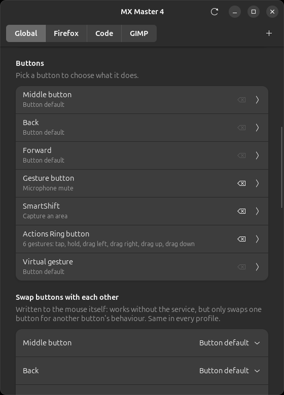
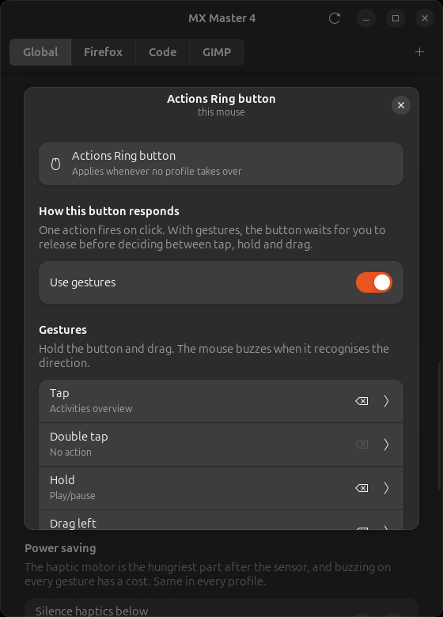
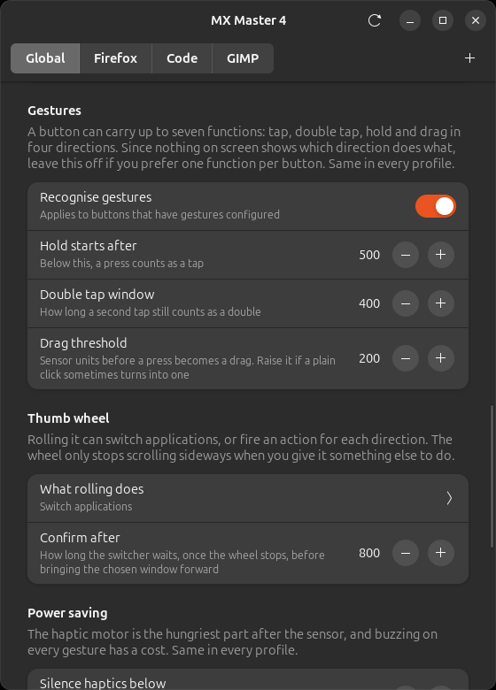

<h1 align="center">logi-tune-linux</h1>

<p align="center">
  <strong>Seu MX Master 4, totalmente configurável no Linux.</strong><br>
  Uma alternativa livre ao Logi Options+ — incluindo o motor háptico e o botão
  do Actions Ring, que nenhuma outra ferramenta Linux alcança.
</p>

<p align="center">
  <a href="https://github.com/renangraciano/logi-tune-linux/actions/workflows/tests.yml"></a>
  <a href="https://github.com/renangraciano/logi-tune-linux/releases/latest"></a>
  <a href="https://github.com/renangraciano/logi-tune-linux/releases"></a>
  <a href="https://github.com/renangraciano/logi-tune-linux/discussions"></a>
  <a href="https://github.com/renangraciano/logi-tune-linux/issues"></a>
</p>

<p align="center">
  <a href="SECURITY.md"></a>
  <a href="LICENSE"></a>
  
  
  <a href="CONTRIBUTING.md"></a>
  
</p>

<p align="center">
  <a href="README.md">🇬🇧 Read in English</a>
</p>

<p align="center">
  
</p>

---

A Logitech publica o Options+ para Windows e macOS. No Linux, nada — sem
controle de DPI, sem SmartShift, sem remapeamento de botões e sem nenhum dos
recursos novos do MX Master 4.

Este projeto fala **HID++ 2.0 direto com `/dev/hidraw`**. Sem Solaar, sem
logiops, sem root.

## O que funciona

Tudo abaixo foi verificado em hardware real: um MX Master 4 (WPID `B042`,
firmware `RBM 27.03.B0019`) por receptor Bolt, Ubuntu 24.04.4, GNOME 46, X11.

| | Recurso | HID++ |
| --- | --- | --- |
| ✅ | Nível de bateria e estado de carga | `0x1004` |
| ✅ | Sensibilidade do ponteiro (200–8000 DPI) | `0x2201` |
| ✅ | Ponto de virada do SmartShift e modo da roda | `0x2111` |
| ✅ | Rolagem de alta resolução e inversão | `0x2121` |
| ✅ | Direção da roda do polegar | `0x2150` |
| ✅ | Remapeamento e desvio de botões | `0x1B04` |
| ✅ | Easy-Switch entre três computadores | `0x1814` `0x1815` |
| ✅ | **Feedback háptico — 15 padrões** | `0x19B0` |
| ✅ | **Roda do polegar com qualquer ação, ou o alternador** | `0x2150` |
| ✅ | Perfis por aplicação, ponteiro e rolagem inclusos (X11) | — |
| ✅ | **53 ações para atribuir a botões** | — |
| ✅ | Gestos num botão segurado (opcional) | `0x1B04` |
| ✅ | Calar o motor háptico com bateria baixa | `0x1004` |
| ✅ | Ajustes de ponteiro do sistema (GNOME) | — |
| 🚧 | Menu radial do Actions Ring | `0x01A0` |

## Três coisas que você não encontra em outro lugar

**O motor háptico funciona.** A feature `0x19B0` não era documentada. A sondagem
do hardware estabeleceu que a função `0x04` toca um padrão de vibração, que os
índices 0–14 são aceitos e que 15 em diante são recusados com
`INVALID_ARGUMENT`:

```bash
logitune haptic --all
```

**O botão do Actions Ring é alcançável.** O MX Master 4 trouxe um botão que não
existe em nenhum modelo anterior — controle `0x01A0`, tarefa `0x0109`. Ele é
remapeável e desviável, então já dá para ligá-lo a qualquer ação:

```bash
logitune watch 0x01A0     # veja o evento chegar ao apertar o botão
```

Entre o botão e o motor, as duas metades de hardware do Actions Ring estão
resolvidas. Falta desenhar o menu radial — veja o [roadmap](#roadmap).

**Um botão pode carregar sete funções.** Todo botão desviável reporta o
movimento enquanto está pressionado, então toque, toque duplo, segurar e
arrastar em quatro direções são todos distinguíveis — contra uma função por
botão no aplicativo oficial, o que é limite do software deles e não do
hardware. Os limiares foram medidos, não chutados.

## Instalação

### Pelo .deb (Ubuntu, Debian e derivados)

Baixe o pacote da
[última release](https://github.com/renangraciano/logi-tune-linux/releases/latest)
e instale com o apt, que resolve as dependências:

```bash
sudo apt install ./logi-tune-linux_*_all.deb
```

Use o `apt`, não o `dpkg -i`: o pacote precisa do `python3-gi` e das typelibs
do GTK 4 e da libadwaita, e o `dpkg` instalaria sem elas, deixando a janela sem
conseguir abrir.

O pacote leva a regra udev, a entrada de menu e a unidade do serviço. Sobram
dois passos, e nenhum dá para fazer por você:

```bash
# 1. Reconecte o receptor para a regra valer, e faça logout/login para o
#    acesso ao /dev/uinput ser concedido à sua sessão.
# 2. Ligue o serviço que aplica ações e perfis.
systemctl --user enable --now logitune-daemon

logitune doctor    # confere cada passo e diz o que falta
```

Para remover: `sudo apt remove logi-tune-linux`. Leia antes a nota sobre
ajustes guardados no mouse em [desinstalando](#desinstalando) — alguns
sobrevivem ao pacote.

### A partir do código

Também é como obter o que ainda não saiu numa release.

```bash
git clone https://github.com/renangraciano/logi-tune-linux.git
cd logi-tune-linux

# Dependências. O python3-xlib só serve para perfis por aplicação;
# o gettext, só para as traduções.
sudo apt install python3-gi gir1.2-gtk-4.0 gir1.2-adw-1 python3-evdev \
                 python3-xlib gettext pipx

# Acesso ao dispositivo sem root: o mouse e o /dev/uinput para síntese de teclas.
sudo scripts/install-udev.sh

# Instalação. O --system-site-packages deixa o ambiente isolado enxergar o
# PyGObject que a interface GTK usa, instalado pelo apt no sistema.
pipx install --system-site-packages .

# Adiciona ao menu de aplicativos. O pipx instala os comandos, mas não a
# entrada de menu — sem isto o aplicativo não aparece no lançador.
scripts/install-desktop.sh

# Sobe o serviço em segundo plano. Ações de botão, gestos e perfis são todos
# aplicados por ele — sem o serviço o aplicativo abre, mas um botão que você
# configurar não faz nada.
cp packaging/systemd/logitune-daemon.service ~/.config/systemd/user/
systemctl --user enable --now logitune-daemon
```

**Desconecte e reconecte o receptor** depois de instalar a regra udev, e então
rode `logitune doctor` — ele confere cada um dos passos acima e diz o que
fazer para o que estiver faltando.

> **Por que pipx?** O Ubuntu 24.04 e outras distribuições recentes marcam o
> Python do sistema como gerenciado externamente
> ([PEP 668](https://peps.python.org/pep-0668/)), então `pip install --user` se
> recusa a rodar. O pipx dá um ambiente próprio a cada aplicação e coloca
> `logitune`, `logitune-gui` e `logitune-daemon` no seu `PATH`. Se
> `~/.local/bin` não estiver no `PATH`, rode `pipx ensurepath` e abra um
> terminal novo.

### Atualizando

Pelo .deb, baixe o pacote novo e instale do mesmo jeito — o apt substitui a
versão instalada:

```bash
sudo apt install ./logi-tune-linux_*_all.deb
systemctl --user restart logitune-daemon
```

A partir do código:

```bash
cd logi-tune-linux
git pull
pipx install --system-site-packages --force .
systemctl --user restart logitune-daemon
```

O `--force` é o que faz o pipx substituir a instalação existente em vez de
recusar por já haver o pacote. Suas configurações ficam em
`~/.config/logitune/config.json` e não são tocadas.

Rode também `sudo scripts/install-udev.sh` se o `logitune doctor` reclamar de
acesso ao dispositivo depois de atualizar — a regra muda pouco, mas quando
muda precisa ser reinstalada, com um replug em seguida.

### Desinstalando

Pelo .deb — o pacote é dono da regra, da unidade e da entrada de menu, então
removê-lo leva tudo junto:

```bash
systemctl --user disable --now logitune-daemon
sudo apt remove logi-tune-linux
```

A partir do código:

```bash
systemctl --user disable --now logitune-daemon
rm ~/.config/systemd/user/logitune-daemon.service

scripts/install-desktop.sh --uninstall   # entrada de menu e ícone
pipx uninstall logi-tune-linux
sudo rm /etc/udev/rules.d/70-logitune.rules
```

As configurações continuam em `~/.config/logitune/` até você removê-las.

**O que o mouse guarda na própria memória sobrevive à desinstalação** — botão
desviado, roda do polegar desviada, remapeamento de firmware. Rode
`logitune button <cid> --reset` e `logitune scroll --no-thumb-divert` antes de
remover o pacote, ou o mouse continua se comportando como configurado sem nada
que explique por quê. É a mesma armadilha que o Solaar deixa, descrita nas
[limitações conhecidas](#limitações-conhecidas).

## Uso

Há três formas de usar, e todas compartilham os mesmos ajustes.

**O aplicativo.** Procure por *Logi Tune Linux* no menu de aplicativos, ou rode
`logitune-gui`. Escolha um botão na lista para definir o que ele faz, acrescente
um perfil por aplicativo e ajuste os tempos dos gestos e da roda do polegar.

Tudo que você muda é gravado na configuração e o daemon aplica sem reiniciar —
inclusive a velocidade do ponteiro e as chaves de rolagem, que é o que as faz
valer por perfil. Escrever direto no mouse não bastaria: o daemon reaplica o
perfil a cada troca de janela, então um ajuste que só existisse no aparelho
duraria até o próximo aplicativo ganhar o foco.

<p align="center">
  
  
</p>

**O daemon**, em segundo plano, reconfigurando o mouse conforme o aplicativo em
foco. Veja [abaixo](#perfis-por-aplicação).

**A linha de comando**, para automação e para os comandos de engenharia
reversa:

```bash
logitune                      # resumo
logitune dpi 1600             # sensibilidade do ponteiro
logitune smartshift 40        # ponto de virada do ratchet
logitune scroll --invert
logitune buttons              # lista os controles e seus mapeamentos
logitune button voltar --remap 0x0052
logitune hosts                # computadores pareados
logitune host 2               # move o mouse para o canal 2
logitune haptic 3             # toca um padrão de vibração
logitune actions              # o catálogo que um botão pode receber
logitune actions --run media.play_pause   # experimenta uma
logitune watch --raw-xy       # mede movimento, para calibrar gestos
logitune watch --thumb        # observa a roda do polegar reportando giro
logitune scroll --no-thumb-divert         # devolve a rolagem horizontal
logitune doctor               # verifica permissões, dependências e o mouse
logitune-gui                  # interface gráfica
```

### Perfis por aplicação

O daemon observa a janela em foco e reconfigura o mouse conforme você troca de
aplicativo — um DPI menor no navegador, a roda travada no editor.

```bash
logitune-daemon --write-example   # cria ~/.config/logitune/config.json
```

```json
{
  "default": { "dpi": 2800, "smartshift": 32 },
  "profiles": [
    {
      "name": "Navegador",
      "match": { "wm_class": ["firefox", "brave", "chrome"] },
      "settings": { "dpi": 2000 }
    },
    {
      "name": "Editor",
      "match": { "wm_class": ["code"] },
      "settings": {
        "dpi": 3200,
        "ratchet": true,
        "actions": { "0x01A0": "xdotool key super" }
      }
    }
  ]
}
```

`buttons` remapeia um controle no firmware; `actions` desvia o botão para que o
daemon execute um comando. Os botões desviados são restaurados quando o daemon
encerra.

O daemon fica bloqueado em `select` sobre os descritores do X e do hidraw — sem
polling e sem consumo de CPU em repouso.

### Ações de botão

`logitune actions` lista tudo que um botão pode fazer, agrupado como o Logi
Options+ agrupa, com uma marca no que estiver indisponível na sua sessão e o
motivo. Na janela, escolha um botão na lista. No arquivo, atribua pelo id:

```json
"bindings": {
  "0x0053": "browser.back",
  "0x0056": { "action": "key.shortcut", "keys": "ctrl+shift+t" },
  "0x00C4": { "action": "app.launch", "app": "org.gnome.Calculator.desktop" }
}
```

O aplicativo grava o id do `.desktop` por você — o campo abre a lista dos
aplicativos instalados em vez de exigir que você saiba um. Escrito à mão, ele
também aceita o nome do comando (`gnome-calculator`) ou o nome visível
(`Calculadora`).

Cada ação passa pelo backend que lhe cabe, e a diferença importa:

| Tipo de ação | Backend | Precisa de |
| --- | --- | --- |
| Mídia, bloquear tela, grade de aplicativos | D-Bus (MPRIS, GNOME Shell) | nada |
| Volume, mudo do microfone | PipeWire (`wpctl`) | nada |
| Abrir aplicativo, arquivo ou endereço | `Gio.AppInfo` | nada |
| DPI, modo da roda, Easy-Switch, háptico | HID++, pilha nossa | nada |
| Atalhos de teclado (copiar, abas, áreas de trabalho) | `uinput` | a regra udev |

Só a última linha precisa do `/dev/uinput`, porque alcançar o aplicativo em
foco é a única coisa que nenhuma API de sessão faz.

Um botão cuja ação não pode rodar fica com a função de fábrica em vez de ser
desviado: um botão morto, que não faz nada e não avisa, é pior que um botão que
ainda clica.

### Gestos (opcional)

**Um botão, uma ação é o padrão, e para a maioria deve continuar assim.** Há um
interruptor no aplicativo, em *Gestos*.

Se quiser mais, um botão carrega até sete funções — toque, toque duplo,
segurar e arrastar em quatro direções:

```json
"bindings": {
  "0x01A0": {
    "tap":        "system.overview",
    "hold":       "media.play_pause",
    "drag_left":  "workspace.left",
    "drag_right": "workspace.right"
  }
}
```

Seja honesto consigo antes de ligar. **Gestos são invisíveis**: nada na tela diz
qual direção faz o quê, e seis funções num botão é mais do que a maioria lembra
de forma confiável. O Logi Options+ dá uma função só àquele botão por isso, não
por limite técnico.

Os limiares foram medidos em 25 pressionadas no hardware, não chutados, e a
medição contrariou o que se esperaria:

- Um clique comum chega a deslocar o mouse **98 unidades** — a mão empurra ao
  apertar. Um limiar só por distância dispara arrastos que ninguém pediu.
- Movimento acidental sempre chega em **0 ou 1 amostra**; um arrasto real, em
  **29 a 72**. Um esbarrão é um solavanco, um arrasto é um fluxo — por isso um
  arrasto exige distância *e* continuidade.

Ajuste em *Gestos*, no aplicativo, ou no arquivo:

```json
"gestures": { "enabled": true, "drag_units": 200, "drag_samples": 3, "hold_ms": 500, "double_tap_ms": 400 }
```

Meça os seus com `logitune watch <cid> --raw-xy`.

<p align="center">
  
</p>

### A roda do polegar

Girá-la pode alternar aplicativos em vez de rolar para os lados — o recurso que
o Logi Options+ chama de App Switcher — ou disparar qualquer ação do catálogo,
uma por sentido de giro. Escolha em *Roda do polegar*, no aplicativo, ou:

```json
"default": { "thumbwheel": "window.switch_apps" },
"wheel": { "switcher_idle_ms": 800 }
```

O `switcher_idle_ms` é quanto o alternador espera, depois que a roda para, para
trazer a janela escolhida à frente. Uma ação por sentido também funciona:

```json
"thumbwheel": { "up": "media.volume_up", "down": "media.volume_down" }
```

A roda só é desviada quando tem algo atribuído. Desviá-la à toa custa a rolagem
horizontal e não devolve nada — que é exatamente o estado que o Solaar deixa
para trás, e o que o `logitune doctor` agora distingue de uma roda desviada de
propósito.

### Ajustes do sistema

Parte do que o Logi Options+ oferece não é do mouse, e sim da área de trabalho.
Em *Sistema* o aplicativo edita as chaves do GNOME direto:

| Ajuste | Chave do `gsettings` |
| --- | --- |
| Canhoto | `org.gnome.desktop.peripherals.mouse left-handed` |
| Velocidade do ponteiro | `…mouse speed` |
| Aceleração | `…mouse accel-profile` |

Estes **não** são ajustes do dispositivo, e a seção diz isso. Valem para todo
apontador, inclusive o touchpad, são os mesmos em qualquer perfil, e continuam
depois que este programa for desinstalado. A velocidade do ponteiro em especial
é outra coisa que o DPI: o DPI mora no mouse e viaja com ele, esta não.

A seção some por completo em ambientes sem o esquema do GNOME, onde não haveria
onde escrever.

### Economia de energia

O motor háptico é o que mais consome depois do sensor. Em *Economia de energia*
dá para calá-lo abaixo de uma carga:

```json
"power": { "haptics_below": 20 }
```

Zero desliga a economia. Com o mouse carregando o motor toca de qualquer forma:
ligado na tomada não há o que economizar.

## Comparação

| | logi-tune-linux | Solaar | logiops |
| --- | --- | --- | --- |
| Conhece o MX Master 4 | ✅ | parcialmente | ❌ (`B042` sem suporte na 0.3.3) |
| Feedback háptico | ✅ | ❌ | ❌ |
| Botão do Actions Ring | ✅ | aparece como desconhecido | ❌ |
| Roda sem root | ✅ | ✅ | ❌ |
| Perfis por aplicação | ✅ | ❌ | ✅ |
| Lê o estado de volta (bateria, DPI) | ✅ | ✅ | ❌ |
| Escopo | um dispositivo, bem feito | toda a linha Logitech | remapeamento de botões |

O Solaar é um projeto excelente e o trabalho de engenharia reversa dele embasou
partes deste protocolo. A proposta aqui é outra: reproduzir a experiência do
Options+ para um mouse específico, incluindo hardware que nada no Linux suporta.

## Engenharia reversa

O MX Master 4 anuncia 46 features HID++. Estas não constam na documentação
pública:

| Feature | Situação |
| --- | --- |
| `0x19B0` | **motor háptico** — decifrada, veja [docs/haptic-waveforms.md](docs/haptic-waveforms.md) |
| `0x19C0` | responde às funções `0x00`–`0x02`; os valores variam entre leituras, o que sugere sensor |
| `0x1701` | não decifrada |
| `0x00D1` | não decifrada |

Também corrigido no caminho: na feature `0x1815`, `getHostFriendlyName` é a
função `0x03`, não a `0x02` — a `0x02` devolve um identificador do host.

```bash
logitune features    # tabela completa de features HID++
logitune watch       # desvia botões e mostra os eventos que eles emitem
```

## Roadmap

Acompanhado como [issues](https://github.com/renangraciano/logi-tune-linux/issues).

**Arriscado, ou pesquisa de resultado incerto**

- [#14](https://github.com/renangraciano/logi-tune-linux/issues/14) Rolagem
  estendida — o item mais arriscado; desviar a roda pode deixar um mouse que
  não rola
- [#15](https://github.com/renangraciano/logi-tune-linux/issues/15) Menu radial
  do Actions Ring via extensão do GNOME Shell, que também resolve os perfis por
  aplicação no Wayland
- [#16](https://github.com/renangraciano/logi-tune-linux/issues/16) Decifrar a
  intensidade háptica e o `0x19C0` — pode não estar exposto
- [#17](https://github.com/renangraciano/logi-tune-linux/issues/17) Testar em
  mouses além do MX Master 4 — a pilha é HID++ 2.0 genérica, falta hardware
- [#33](https://github.com/renangraciano/logi-tune-linux/issues/33) Um Flatpak.
  O sandbox não consegue instalar a regra udev nem a unidade do serviço no
  hospedeiro, então ele não eliminaria os passos manuais que o `.deb` elimina —
  que é o motivo de ele não ser simplesmente o próximo pacote

## Limitações conhecidas

- **Wayland**: o protocolo não deixa um aplicativo comum saber qual janela está
  em foco, então os perfis por aplicação ficam desativados. O resto funciona
  normalmente, e o daemon avisa ao iniciar.
- **Rodar junto com o Solaar** funciona, mas os dois escrevem no mesmo
  dispositivo e podem desfazer os ajustes um do outro. Use um de cada vez.
- **O modo da roda é volátil**: com o SmartShift ativo, o firmware alterna entre
  ratchet e roda livre sozinho. Forçar um modo vale até a próxima rolagem
  rápida.
- Testado apenas com o MX Master 4 por receptor Bolt.

## Traduzindo

O idioma de origem é o inglês; o resto são catálogos `gettext`, o português
brasileiro inclusive — ele era o original e virou tradução para que chegar pelo
README não signifique encontrar um idioma que você talvez não leia.

```bash
sudo apt install gettext
scripts/build-translations.sh          # compila os catálogos
LOGITUNE_LANG=pt_BR logitune-gui       # experimenta sem mudar a sessão
```

Para começar um idioma novo, copie `po/logi-tune-linux.pot` para `po/<código>.po`,
preencha as linhas `msgstr` e rode o script de build. Depois de mexer em
qualquer texto traduzível do código, rode `scripts/update-translations.sh` — a
suíte de testes reprova quando o catálogo fica para trás, que é o que impede
uma mensagem de aparecer sem tradução numa janela traduzida.

A instalação compila os catálogos sozinha. Sem o `gettext` na máquina o build
pula esse passo com um aviso e a interface fica em inglês, o que é um programa
funcionando em vez de uma instalação quebrada.

## Contribuindo

Relatos de dispositivo são a contribuição mais valiosa — `logitune features` e
`logitune buttons` de um mouse que ainda não vimos descrevem toda a superfície
HID++ dele. Veja o [CONTRIBUTING.md](CONTRIBUTING.md).

## Créditos

A engenharia reversa por trás do [Solaar](https://github.com/pwr-Solaar/Solaar)
e a especificação pública do HID++ 2.0 da Logitech foram a base para entender o
protocolo. Que o recurso `0x19B0` é o motor háptico foi identificado de forma
independente por [ncr/mx-master-4-haptic](https://github.com/ncr/mx-master-4-haptic)
e [talamar49/orbit-mouse](https://github.com/talamar49/orbit-mouse), e a
sondagem daqui concorda com os dois.

## Licença

[GPL-3.0-or-later](LICENSE).
